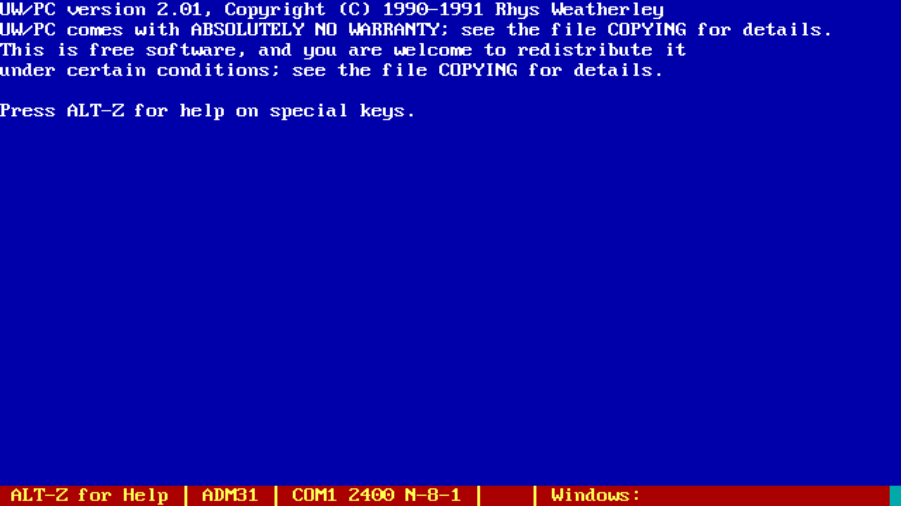
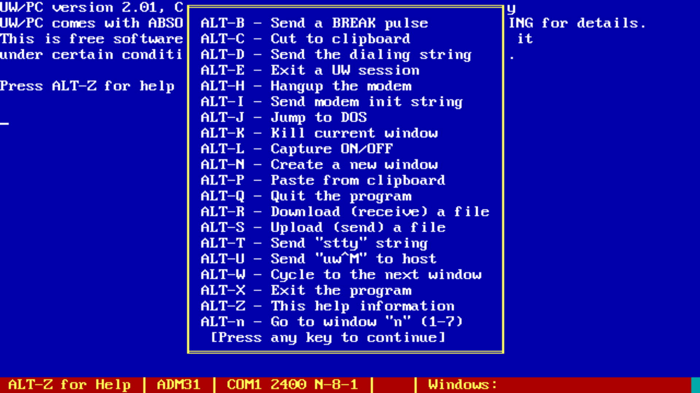
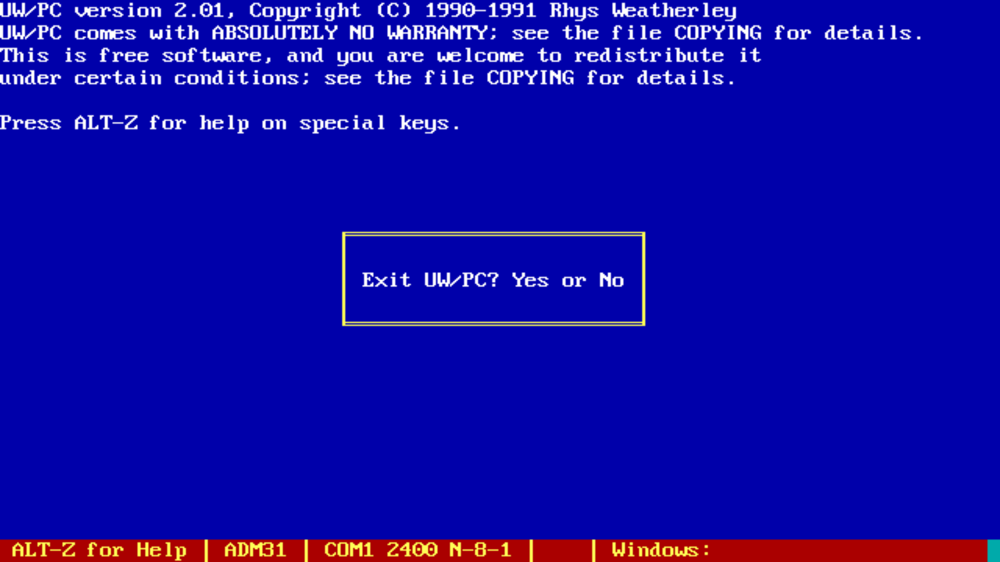

UW/PC - Unix Windows for PC
===========================

This is a historical project of mine from the early 1990's called UW/PC.

UW/PC was a multiple-window interface to UNIX for IBM-PC's and compatible
computers.  It was structured as a terminal program that could be used to
dial up to the Unix machine via a modem.

After connecting, you would start the "uw" server on the Unix side of the
connection.  This server could create up to seven virtual sessions over
the dial-up serial link, with special escape sequences to switch between
sessions.

If a program in one session is printing data, the escape sequences switch the
client to write to that window's buffer.  Similarly, if the user types in a
window, then escape sequences are sent to switch back to that session on the
server side to deliver the keystrokes to the correct pty on the Unix side.
UW/PC uses ALT+1, ALT+2, etc to switch between windows.

The protocol was very efficient.  Under normal interactive use, the user
would hardly notice the overhead; even on slow 2400 baud modems.  There were
performance issues if one window was outputting a lot of text or performing a
file transfer, but interactive use was very snappy.

The "uw" server was originally created by John Bruner with a client for
Macintosh computers.  I made the PC client for MS-DOS, and eventually a
client for Windows 3.0.

The Linux "screen" utility provides similar functionality these days,
but the Unix Windows protocol was fairly unique in the late 1980's and
early 1990's.

See [UW.TXT](UW.TXT) for the historical documentation.

Screenshots
-----------

Unfortunately I don't have the server working yet on a system I can "dial"
into, but may put up some extra screenshots when I can do that.  Here are
some of the basic screens.  There is no online configuration; that was
done by manually editing the "UW.CFG" file.

Source Code
-----------

The source code for UW/PC for MS-DOS is under the "src" directory.
The source code for the Unix Windows server from John Bruner is in the
"server" directory.

I have cleaned up the code and checked in the source code for all
MS-DOS versions.  Branches in the repository called "uwpc-x.xx" are
provided for each major release I was able to recover from my archives.

I am currently missing the source code for versions 1.00, 1.05, and 2.02,
but everything else is available.  The final version 2.03 included a
Windows 3.0 port but it is in an unfinished state.  I haven't checked
2.03 in yet.

The original MS-DOS code was designed to be built with Turbo C++.
I switched to Borland C++ for the later Windows version.  You will need
that or something similar if you want to build it.  I was able to
successfully build the MS-DOS version with [DOSBox](https://www.dosbox.com/)
after installing Turbo C++ 1.01 into the DOSBox environment.

John Bruner's original server code was designed to be built on mid-1980's
BSD 4.3 systems and is written in K&R C.  It would need a lot of work to
build it for modern ANSI C and POSIX compatible systems.

See the [HISTORY.TXT](HISTORY.TXT) file for release notes on each version.

Executables
-----------

I have stripped the original MS-DOS executables out of this repository,
but if you want a copy to run on your old PC then let me know.

License
-------

The first version "UW/PC 1.00" was labelled as freeware but it wasn't
until 1.02 that I made a public release.  I switched to the
GNU General Public License Version 1 for the public releases.
See the [COPYING](COPYING) file.

John Bruner's server code is distributed under the following license:

    Copyright 1985,1986 by John D. Bruner.  All rights reserved.  Permission to
    copy this program is given provided that the copy is not sold and that
    this copyright notice is included.

Contact
-------

For more information on this code, to report bugs, or to suggest
improvements, please contact the author Rhys Weatherley via
[email](mailto:rhys.weatherley@gmail.com).
